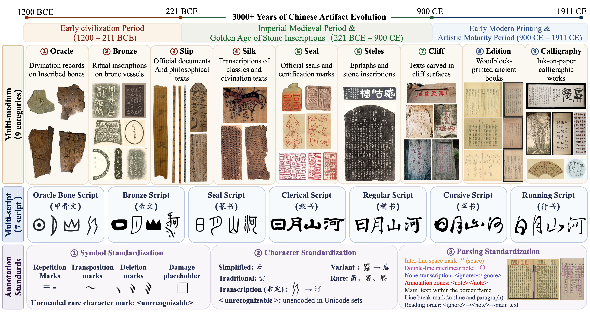
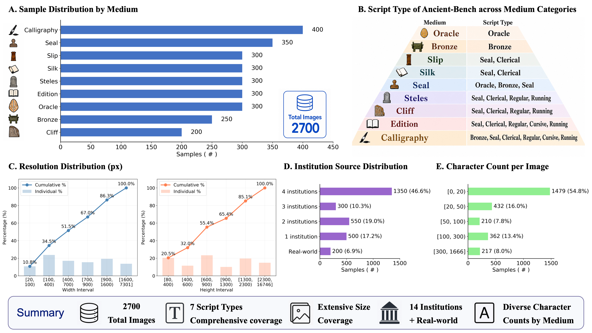

<div align="center">

# Ancient-Bench: 跨三千年、多载体、全书体的古代文物与古籍文字识别基准数据集

[](https://arxiv.org/abs/2608.27169)
[](YOUR_HUGGINGFACE_LINK_HERE)
[](https://pan.baidu.com/s/1Vx8vllHY51wT8aSOa_kGXA?pwd=54su)

[**English**](README.md) | **中文简体**

</div>

---

### 🚨 重要声明
> **本数据集仅限非商业性学术研究使用。**  
> Ancient-Bench 数据集所收录图像均源自各大博物馆、图书馆等公开发布的数字化文博资源。论文作者团队不拥有亦不转让任何原始图像版权。使用者必须严格遵守原始藏品机构的数据使用条款，严禁任何形式的商业营利行为。

---

## 📥 数据集下载通道

| 下载平台 | 访问链接 | 提取码 / 备注 |
| :--- | :--- | :---: |
| **百度网盘** | [🔗 点击进入百度网盘下载页面](https://pan.baidu.com/s/1Vx8vllHY51wT8aSOa_kGXA?pwd=54su) | **`54su`** |
| **Hugging Face** | [🤗 数据集主页直达](YOUR_HUGGINGFACE_LINK_HERE) | 无需提取码 |

---

## 📌 数据集概述

**Ancient-Bench**（已被 **EMNLP 2026** 录用）是首个面向中国古代文物与典籍文字识别的**跨三千年（Multi-millennial）、多载体（Multi-medium）、全书体（Multi-script）**大型评测基准。

数据集收录了 **2,700 张经过极精细考释标注的高清图像**，跨越商代至清代（公元前 1200 年至公元 1911 年）三千余年文字演进历程，涵盖来自 14 家国家级权威文博机构的 **9 大文物载体类型**，覆盖了汉字发展史上的 **7 大主流书体**。

针对以往古代文字数据碎片化、标准不一的困境，Ancient-Bench 确立了三大标准化规程：**特殊符号标准化**、**古字考释与文字标准化**、以及**版面排版解析标准化**。

<p align="center">
  
</p>

## ✨ 核心亮点

1. **跨三千年演进 (Multi-millennial):** 纵贯早期文明期（甲骨、青铜、简帛）、中古金石鼎盛期（印章、碑志、摩崖）与近世印刷艺术成熟期（刻本、书法）。
2. **九大多元载体 (Multi-medium):** 完整涵盖甲骨、青铜器、简牍、帛书、印章、碑帖、摩崖石刻、古籍刻本、书法墨迹。
3. **七大书体全覆盖 (Multi-script):** 完整包含甲骨文、金文、篆书、隶书、楷书、草书、行书。
4. **来源权威真实:** 数据精选自 14 家国家级重点文博图书馆藏机构及真实自然场景摩崖，覆盖残损、渗墨、剥落等真实复杂挑战。

## 📊 数据统计与分布

<p align="center">
  
</p>

| 载体类别 | 图像数 | 分辨率范围 (px) | 单图字数跨度 | 来源机构数 | 涵盖主要书体 |
| :--- | :---: | :---: | :---: | :---: | :--- |
| **甲骨 (Oracle)** | 300 | 600×800 | 1–68 | 1 | 甲骨文 |
| **金文 (Bronze)** | 250 | 41×80 – 1024×1024 | 1–77 | 2 | 金文 |
| **简牍 (Slip)** | 300 | 29×224 – 700×6820 | 1–107 | 3 | 篆书、隶书 |
| **帛书 (Silk)** | 300 | 46×124 – 1330×2067 | 1–784 | 2 | 篆书、隶书 |
| **印章 (Seal)** | 350 | 100×150 – 1333×1341 | 1–40 | 4 | 甲骨文、金文、篆书 |
| **碑帖 (Steles)** | 300 | 85×155 – 5795×16745 | 4–816 | 4 | 篆书、隶书、楷书、行书 |
| **摩崖 (Cliff)** | 200 | 183×113 – 7300×5760 | 2–216 | 真实自然场景 | 篆书、隶书、楷书、行书 |
| **古籍 (Edition)** | 300 | 751×506 – 970×2817 | 4–776 | 1 | 篆、隶、楷、草、行 |
| **书法 (Calligraphy)** | 400 | 303×509 – 4802×13385 | 2–1666 | 4 | 金、篆、隶、楷、草、行 |
| **总计** | **2,700** | **41×80 – 5795×16745** | **1–1666** | **14 家机构 + 自然场景** | **7 大书体全覆盖** |

## 📐 标注规范与标准化体系

- **符号标准化 (Symbol Standardization):** 严格保留重文号（`=`、`-`）、错置符号（`~`）、字迹剥落残损占位符（`□`）与未编码古字标记（`<unrecognizable>`），不随意改写或隐匿。
- **文字标准化 (Character Standardization):** 早期古文字严格依据权威共识进行古文字学隶定；严格恪守“所见即所得”，绝不强行将原始异体/繁体替换为通行字，杜绝字义失真。
- **排版解析标准化 (Parsing Standardization):** 遵循原始自然阅读顺序逐列换行；采用 `（）` 标注双行夹注；使用 `<ignore>` 标注文物版心/书耳等非正文内容；使用 `<note>` 标注天头、地脚、眉批及侧注等批注区。

---

## ⚖️ 版权声明与学术伦理协议

1. **仅限学术研究:** Ancient-Bench 数据集仅用于非营利性的学术研究、文献数字化评测与算法评估，严禁任何商业用途。
2. **版权归属:** 本数据集所收录的原始文物图像版权归属其原藏机构所有，研究团队不主张且不转让原始图像版权。
3. **规范遵循:** 任何下载、调用本数据集的研究者与团队，需严格遵守各文化遗产机构的公共知识服务许可条例。

---

## 📖 论文引用

若本基准数据集对您的科研工作有所启发或帮助，请引用我们的 EMNLP 2026 论文：

```bibtex
@inproceedings{cheng2026ancientbench,
  title={Ancient-Bench: A Comprehensive Multi-millennial, Multi-medium, and Multi-script Benchmark for Ancient Chinese Artifact Text Recognition},
  author={Cheng, Hiuyi and Xu, Nuo and Zhang, Yuyi and Zheng, Xuhan and Pan, Wei and Zhang, Jing and Peng, Dezhi and Liao, Minghui and Teng, Yihua and Wu, Jihao and Ren, Haoyu and Jin, Lianwen},
  booktitle={Proceedings of the 2026 Conference on Empirical Methods in Natural Language Processing (EMNLP)},
  year={2026},
  url={https://arxiv.org/abs/2608.27169}
}
